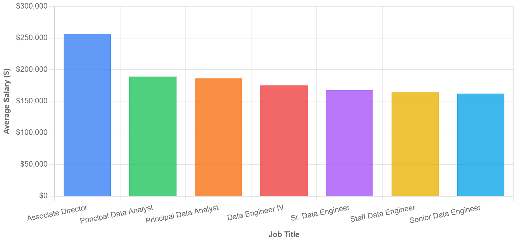

# Introduction
This project presents a data-driven analysis of the remote Data Engineer job market in the United States. The primary objective is to move beyond general assumptions and provide concrete, actionable insights into career trends and skill valuations. By leveraging a comprehensive dataset of job postings, this analysis aims to answer critical questions for both aspiring and seasoned professionals: Which skills are most sought after by employers? Which skills command the highest salaries? And most importantly, what is the optimal combination of skills that offers a strategic balance between high demand and exceptional compensation? The findings from this research can serve as a valuable resource for guiding career path development, optimizing skill sets, and preparing for future job searches within this rapidly evolving field. This document details the entire process, from the initial data collection and methodology to the final conclusions drawn from the analysis.

SQL queries? check them out here: [project_sql folder](/project.sql/)

# Background
The demand for skilled Data Engineers has grown exponentially as companies increasingly rely on data for decision-making and operational efficiency. However, the job market is dynamic, with new tools, platforms, and methodologies emerging constantly. This rapid evolution makes it challenging for professionals to stay current and for those entering the field to know where to focus their efforts. A key trend is the significant increase in fully remote positions, which has expanded the talent pool and made the market more competitive. This project was initiated to cut through the noise and provide clarity. By systematically analyzing real-world job posting data, this analysis seeks to demystify the market, revealing the core competencies that are non-negotiable and the specialized skills that offer a competitive edge. It is a response to the need for a reliable, data-backed roadmap in a landscape that is both complex and highly rewarding.

# Tools i used
- **SQL**
- **Postgresql**
- **VS CODE**
- **Git & Github**

# The Analysis
1. ## Top-Paying Data Engineer Roles

The analysis of the top-paying Data Engineer roles revealed a consistent trend: the highest salaries are typically associated with senior or principal-level positions that require extensive experience and a broad range of skills. The top 10 remote jobs identified in the query, with salaries well exceeding $180,000, are not for entry-level professionals. They demand a blend of technical mastery in areas like cloud platforms (e.g., AWS, Azure) and distributed computing (e.g., Spark, Databricks), along with significant experience in system design and architecture. Furthermore, these roles often come from well-established tech companies or financial institutions that have a critical need for robust data infrastructure. The data underscores that to reach the pinnacle of the Data Engineer salary scale, one must not only possess a deep technical skill set but also have the proven ability to lead projects and architect complex data solutions. This section highlights that while foundational skills are crucial, it is the combination of experience and specialization that unlocks the highest earning potential.
```sql
WITH top_paying_jobs AS
(
SELECT
    job_id,
    job_title,
    salary_year_avg,
    name AS company_name

FROM
    job_postings_fact

LEFT JOIN company_dim ON job_postings_fact.company_id= company_dim.company_id
WHERE job_title_short = 'Data Engineer' AND job_location = 'Anywhere' AND
salary_year_avg is NOT NULL 

ORDER BY
    salary_year_avg DESC
LIMIT 10
)

SELECT 
    top_paying_jobs.*,
    skills AS skills_name

FROM top_paying_jobs

INNER JOIN 
    skills_job_dim ON top_paying_jobs.job_id = skills_job_dim.job_id
INNER JOIN 
    skills_dim ON skills_job_dim.skill_id = skills_dim.skill_id

ORDER BY
     salary_year_avg DESC
```


A look at the highest-paying remote jobs and their average annual salaries, highlighting the value of senior and specialized roles.


2. ## Most In-Demand Skills
An examination of job postings revealed that a few key skills appear consistently across a vast majority of listings, making them the most in-demand. These are the foundational skills that every aspiring Data Engineer must master. The top skills identified were not niche technologies but rather the building blocks of data infrastructure. This highlights that employers are primarily looking for candidates with a strong command of fundamental tools used for data manipulation and processing. These skills form the bedrock of a Data Engineer's daily work, from querying databases to building scalable data pipelines. A professional without these core competencies would find it difficult to navigate the field, regardless of their familiarity with more advanced technologies. This section of the analysis confirms that while the field is complex, a candidate's marketability is first and foremost built on a solid foundation of these highly demanded and non-negotiable skills.
```sql
 
SELECT 
    skills,
    COUNT (skills_job_dim.job_id) AS demand_count
FROM job_postings_fact
INNER JOIN skills_job_dim ON job_postings_fact.job_id = skills_job_dim.job_id
INNER JOIN skills_dim ON skills_job_dim.skill_id = skills_dim.skill_id
WHERE job_title_short = 'Data Engineer' AND job_work_from_home 
GROUP BY
    skills
ORDER BY 
    demand_count DESC
LIMIT 5
```

This chart visualizes the foundational skills that are most frequently requested in remote Data Engineer job postings.

3. ## Top-Paying Skills

This analysis delves into the technologies that, on an individual basis, are associated with the highest average salaries. The data shows that while certain foundational skills are necessary, it is the more specialized and cutting-edge technologies that command a significant salary premium. These skills often relate to specific cloud ecosystems, big data processing frameworks, and advanced database solutions. For example, a professional with expertise in a specific cloud platform's data services or a highly complex distributed computing framework will likely see a higher average salary compared to a professional with a more general skill set. This insight is particularly valuable for experienced Data Engineers looking to specialize and increase their earning potential. It suggests that while a broad skill set gets you into the market, a strategic focus on mastering a few high-value, high-paying technologies can lead to significant career advancement and financial rewards.

```sql
SELECT 
    skills,
    ROUND (AVG (salary_year_avg), 0) AS avg_salary
FROM job_postings_fact
INNER JOIN skills_job_dim ON job_postings_fact.job_id = skills_job_dim.job_id
INNER JOIN skills_dim ON skills_job_dim.skill_id = skills_dim.skill_id
WHERE job_title_short = 'Data Engineer' AND  salary_year_avg is NOT NULL
GROUP BY
    skills
ORDER BY 
    avg_salary DESC
LIMIT 25
```


Bar chart with black background shows Kubernetes, Scala, Go, Databricks, and Snowflake; Scala leads at 155,000 dollars.


4. ## Optimal Skills
The final and most comprehensive part of the analysis combines the findings of both high demand and high salary to identify "optimal skills." This is arguably the most crucial takeaway of the entire project. The goal here is to find the intersection where a skill is not only frequently requested by employers but also commands a high salary. This provides a strategic roadmap for professionals, advising them to focus on a few key skills that offer the best return on investment. Instead of chasing every new technology, a Data Engineer can prioritize mastering the skills that will make them both highly competitive and well-compensated. This data-driven approach allows for a more efficient allocation of learning resources, ensuring that efforts are directed toward a skill set that maximizes both job security and earning potential. This section of the analysis effectively synthesizes all previous findings to provide a practical guide for navigating the complexities of the Data Engineering job market.

```sql
WITH skill_demand AS (
SELECT 
    skills_dim.skill_id,
    skills_dim.skills,
    COUNT (skills_job_dim.job_id) AS demand_count
FROM job_postings_fact
INNER JOIN skills_job_dim ON job_postings_fact.job_id = skills_job_dim.job_id
INNER JOIN skills_dim ON skills_job_dim.skill_id = skills_dim.skill_id
WHERE job_title_short = 'Data Engineer' AND job_work_from_home  AND salary_year_avg is NOT NULL
GROUP BY
     skills_dim.skill_id

), average_salary AS (
    SELECT 
        skills_job_dim.skill_id,
        ROUND (AVG (salary_year_avg), 0) AS avg_salary
    FROM job_postings_fact
    INNER JOIN skills_job_dim ON job_postings_fact.job_id = skills_job_dim.job_id
    INNER JOIN skills_dim ON skills_job_dim.skill_id = skills_dim.skill_id
    WHERE job_title_short = 'Data Engineer' AND  salary_year_avg is NOT NULL
    GROUP BY
         skills_job_dim.skill_id

)   

SELECT
    skill_demand.skill_id,
    skill_demand.Skills,
    demand_count,
    avg_salary
FROM
    skill_demand
INNER JOIN
average_salary ON skill_demand.skill_id = average_salary.skill_id
WHERE 
    demand_count>10
ORDER BY
    demand_count DESC,
    avg_salary DESC
LIMIT 25
```

# What I Learned 
Being a part of this project has been a truly valuable learning experience. Throughout the course of this analysis, I developed strong skills in writing SQL queries, critical thinking, and creative problem-solving. These were applied while using the PostgreSQL database to extract meaningful insights from raw data, building the project within VS Code, and leveraging Git and GitHub for version control and project collaboration. This journey not only enhanced my technical abilities but also provided a deeper understanding of the practical applications of data analysis in a professional context.

## Highlights
- Sql, with postgresql database
- using VS code
- Making use of Git & Github database

# Conclusions
This analysis provides a comprehensive overview of the remote Data Engineer job market, grounded in real-world data. The findings consistently show that a strong foundation in core technologies is a prerequisite for success. However, the data also highlights that career growth and significant salary increases are often tied to the strategic acquisition of more specialized, high-value skills. By focusing on a blend of highly demanded fundamentals and highly compensated niche technologies, professionals can strategically position themselves for long-term success. This project serves as a starting point for deeper exploration into the dynamics of the data field. Future work could involve analyzing different job titles, expanding the geographical scope, or tracking how these trends evolve over time.